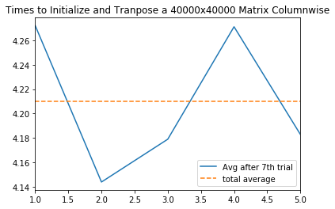
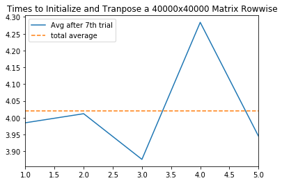
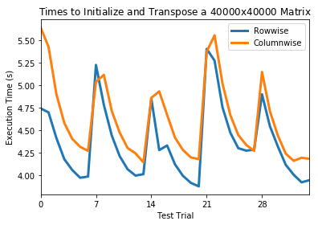
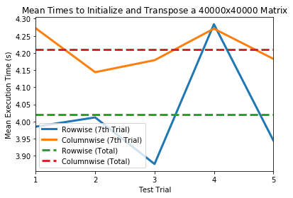

```python
import pandas as pd
from matplotlib import pyplot as plt
%matplotlib inline
```


```python
tests = 7
N = 40000
```

# Columnwise 


```python
columnwise = pd.read_csv('./columnwise.csv', index_col=0)
columnwise.head()
```


<div>
<style>
    .dataframe thead tr:only-child th {
        text-align: right;
    }

    .dataframe thead th {
        text-align: left;
    }

    .dataframe tbody tr th {
        vertical-align: top;
    }
</style>
<table border="1" class="dataframe">
  <thead>
    <tr style="text-align: right;">
      <th></th>
      <th>$index_{max}$</th>
      <th>$max$</th>
      <th>index_{min}</th>
      <th>min</th>
      <th>avg</th>
    </tr>
  </thead>
  <tbody>
    <tr>
      <th>0</th>
      <td>1.0</td>
      <td>5.645</td>
      <td>1.0</td>
      <td>5.645</td>
      <td>5.645</td>
    </tr>
    <tr>
      <th>1</th>
      <td>1.0</td>
      <td>5.645</td>
      <td>2.0</td>
      <td>5.216</td>
      <td>5.431</td>
    </tr>
    <tr>
      <th>2</th>
      <td>1.0</td>
      <td>5.645</td>
      <td>3.0</td>
      <td>3.842</td>
      <td>4.901</td>
    </tr>
    <tr>
      <th>3</th>
      <td>1.0</td>
      <td>5.645</td>
      <td>4.0</td>
      <td>3.620</td>
      <td>4.581</td>
    </tr>
    <tr>
      <th>4</th>
      <td>1.0</td>
      <td>5.645</td>
      <td>4.0</td>
      <td>3.620</td>
      <td>4.405</td>
    </tr>
  </tbody>
</table>
</div>


```python
end_columnwise = columnwise.iloc[columnwise.index[(columnwise.index % tests == 0)] - 1].sort_index()
end_columnwise.index = pd.np.arange(len(end_columnwise)) + 1
```


```python
end_columnwise['total_avg'] = end_columnwise['avg'].mean()
```


```python
end_columnwise.head()
```


<div>
<style>
    .dataframe thead tr:only-child th {
        text-align: right;
    }

    .dataframe thead th {
        text-align: left;
    }

    .dataframe tbody tr th {
        vertical-align: top;
    }
</style>
<table border="1" class="dataframe">
  <thead>
    <tr style="text-align: right;">
      <th></th>
      <th>$index_{max}$</th>
      <th>$max$</th>
      <th>index_{min}</th>
      <th>min</th>
      <th>avg</th>
      <th>total_avg</th>
    </tr>
  </thead>
  <tbody>
    <tr>
      <th>1</th>
      <td>1.0</td>
      <td>5.645</td>
      <td>4.0</td>
      <td>3.620</td>
      <td>4.272</td>
      <td>4.2098</td>
    </tr>
    <tr>
      <th>2</th>
      <td>2.0</td>
      <td>5.195</td>
      <td>7.0</td>
      <td>3.540</td>
      <td>4.144</td>
      <td>4.2098</td>
    </tr>
    <tr>
      <th>3</th>
      <td>2.0</td>
      <td>5.006</td>
      <td>4.0</td>
      <td>3.653</td>
      <td>4.179</td>
      <td>4.2098</td>
    </tr>
    <tr>
      <th>4</th>
      <td>2.0</td>
      <td>5.739</td>
      <td>5.0</td>
      <td>3.560</td>
      <td>4.271</td>
      <td>4.2098</td>
    </tr>
    <tr>
      <th>5</th>
      <td>1.0</td>
      <td>5.150</td>
      <td>4.0</td>
      <td>3.628</td>
      <td>4.183</td>
      <td>4.2098</td>
    </tr>
  </tbody>
</table>
</div>


```python
ax = end_columnwise['avg'].plot(legend=True, title='Times to Initialize and Tranpose a 40000x40000 Matrix Columnwise')
ax = end_columnwise['total_avg'].plot(legend=True, style=['--'])
plt.legend(['Avg after 7th trial', 'total average'])
```


    <matplotlib.legend.Legend at 0x2867ab56940>





```python
end_columnwise['avg'].mean()
```


    4.2097999999999995


# Rowwise 


```python
rowwise = pd.read_csv('./rowwise.csv', index_col=0)
rowwise.head()
```


<div>
<style>
    .dataframe thead tr:only-child th {
        text-align: right;
    }

    .dataframe thead th {
        text-align: left;
    }

    .dataframe tbody tr th {
        vertical-align: top;
    }
</style>
<table border="1" class="dataframe">
  <thead>
    <tr style="text-align: right;">
      <th></th>
      <th>$index_{max}$</th>
      <th>$max$</th>
      <th>index_{min}</th>
      <th>min</th>
      <th>avg</th>
    </tr>
  </thead>
  <tbody>
    <tr>
      <th>0</th>
      <td>1.0</td>
      <td>4.744</td>
      <td>1.0</td>
      <td>4.744</td>
      <td>4.744</td>
    </tr>
    <tr>
      <th>1</th>
      <td>1.0</td>
      <td>4.744</td>
      <td>2.0</td>
      <td>4.657</td>
      <td>4.700</td>
    </tr>
    <tr>
      <th>2</th>
      <td>1.0</td>
      <td>4.744</td>
      <td>3.0</td>
      <td>3.837</td>
      <td>4.413</td>
    </tr>
    <tr>
      <th>3</th>
      <td>1.0</td>
      <td>4.744</td>
      <td>4.0</td>
      <td>3.476</td>
      <td>4.178</td>
    </tr>
    <tr>
      <th>4</th>
      <td>1.0</td>
      <td>4.744</td>
      <td>4.0</td>
      <td>3.476</td>
      <td>4.058</td>
    </tr>
  </tbody>
</table>
</div>


```python
end_rowwise = rowwise.iloc[rowwise.index[(rowwise.index % tests == 0)] - 1].sort_index()
end_rowwise.index = pd.np.arange(len(end_rowwise)) + 1
```


```python
end_rowwise['total_avg'] = end_rowwise['avg'].mean()
```


```python
end_rowwise.head()
```


<div>
<style>
    .dataframe thead tr:only-child th {
        text-align: right;
    }

    .dataframe thead th {
        text-align: left;
    }

    .dataframe tbody tr th {
        vertical-align: top;
    }
</style>
<table border="1" class="dataframe">
  <thead>
    <tr style="text-align: right;">
      <th></th>
      <th>$index_{max}$</th>
      <th>$max$</th>
      <th>index_{min}</th>
      <th>min</th>
      <th>avg</th>
      <th>total_avg</th>
    </tr>
  </thead>
  <tbody>
    <tr>
      <th>1</th>
      <td>1.0</td>
      <td>4.744</td>
      <td>4.0</td>
      <td>3.476</td>
      <td>3.985</td>
      <td>4.0204</td>
    </tr>
    <tr>
      <th>2</th>
      <td>1.0</td>
      <td>5.228</td>
      <td>5.0</td>
      <td>3.487</td>
      <td>4.012</td>
      <td>4.0204</td>
    </tr>
    <tr>
      <th>3</th>
      <td>1.0</td>
      <td>4.854</td>
      <td>4.0</td>
      <td>3.485</td>
      <td>3.876</td>
      <td>4.0204</td>
    </tr>
    <tr>
      <th>4</th>
      <td>1.0</td>
      <td>5.407</td>
      <td>5.0</td>
      <td>3.617</td>
      <td>4.284</td>
      <td>4.0204</td>
    </tr>
    <tr>
      <th>5</th>
      <td>1.0</td>
      <td>4.901</td>
      <td>6.0</td>
      <td>3.497</td>
      <td>3.945</td>
      <td>4.0204</td>
    </tr>
  </tbody>
</table>
</div>


```python
ax = end_rowwise['avg'].plot(legend=True, title='Times to Initialize and Tranpose a 40000x40000 Matrix Rowwise')
ax = end_rowwise['total_avg'].plot(legend=True, style=['--'])
plt.legend(['Avg after 7th trial', 'total average'])
```


    <matplotlib.legend.Legend at 0x2867b02fbe0>





```python
end_rowwise['avg'].mean()
```


    4.0204


# Comparisons


```python
title = 'Times to Initialize and Transpose a ${N}$x${N}$ Matrix'
rowwise['avg'].plot(title=title.format(N=N), legend=True, lw=3)
ax = columnwise['avg'].plot(legend=True, lw=3)
ax.legend(['Rowwise', 'Columnwise'])
ax.set_xlabel('Test Trial')
ax.set_ylabel('Execution Time (s)')
_ = ax.set_xticks(7 * (pd.np.arange(len(end_rowwise))))
```





```python
title = 'Mean Times to Initialize and Transpose a ${N}$x${N}$ Matrix'
end_rowwise['avg'].plot(title=title.format(N=N), legend=True, lw=3)
ax = end_columnwise['avg'].plot(legend=True, lw=3)

ax.set_xlabel('Test Trial')
ax.set_ylabel('Mean Execution Time (s)')

ax = end_rowwise['total_avg'].plot(legend=True, style=['--'], lw=3)
ax = end_columnwise['total_avg'].plot(legend=True, style=['--'], lw=3)
ax.legend(['Rowwise (7th Trial)', 'Columnwise (7th Trial)', 'Rowwise (Total)', 'Columnwise (Total)'])

_ = ax.set_xticks(pd.np.arange(len(end_rowwise)) + 1)
```





 
